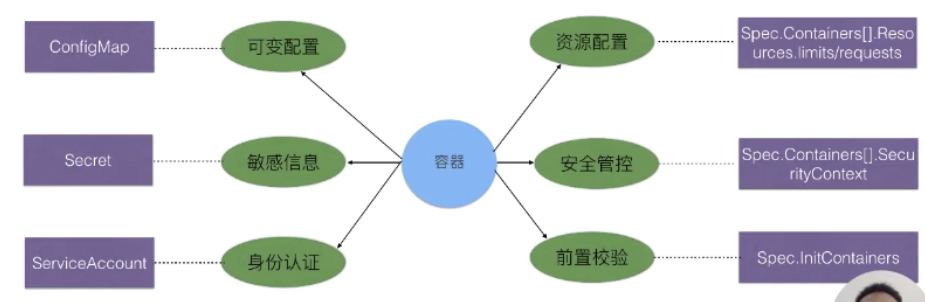
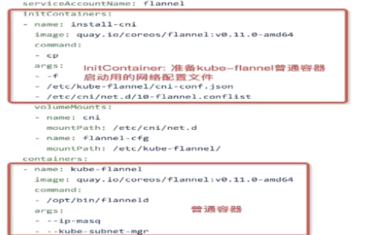

## 1. ConfigMap

ConfigMap是比较特殊的数据卷，主要用来存储配置

### 创建ConfigMap

```yaml
apiVersion: v1
kind: ConfigMap
metadata:
  name: configmap
  namespace: dev
  labels: 
    app: config
data:
  info: |
    username: admin
    password: 123456
    key: value
```


### 使用ConfigMap

ConfigMap主要被Pod使用，一般用户挂载Pod用的配置文件，环境变量等

* Pod只能看到同一个namespace下的ConfigMap
* ConfigMap不要超过1MB

#### 将configmap中的数据定义为环境变量

```yaml
apiVersion: v1
kind: Pod
metadate:
  name: xx
spec:
  containers:
  - name: nginx
    image: nginx
    env:
      - name: USERNAME
        valueFrom:
          configMapKeyRef:
            name: configmap
            key: username
```


#### 将configmap挂载都容器中的某一个目录下

```yaml
apiVersion: v1
kind: Pod
metadata:
  name: xx
spec:
  containers:
  - name: nginx
    image: nginx
    volumeMounts: # 将卷挂载到目录
    - name: config
      mountPath: /configmap/config
 
  volumes: # 定义卷，使用configmap作为卷
  - name: config
    configMap:
      name: configmap
```

我们在ConfigMap中写入的key-value，会在mountPath下生成一个info文件，ConfigMap的内容都写入该info文件


## 2. Secret

与ConfigMap十分相似，它主要用于存储敏感信息，例如密码、秘钥、证书等等

* Secret有4种类型
  * Opaque：普通的Secret文件
  * service-account-token：用于service-acount身份认证的Secret
  * dockerconfigjson：拉取docker镜像仓库用的Secret
  * bootstrap.token：节点接入集群时检验用的Secret

### 创建Secret

```yaml
apiVersion: v1
kind: Secret
metadata:
  name: my-secret
  namespace: x
type: Opaque #Secret类型
data:
  username: YWRtaW4=
  password: MTIzNDU2
```

### 使用Secret

* 主要是Pod使用Secret

#### 将Secret挂载到Volume中

```yaml
apiVersion: v1
kind: Pod
metadata:
  name: xx
  namespace: x
spec:
  containers:
  - name: nginx
    image: nginx
    volumeMounts: # 将卷挂载到目录下
    - name: secret-volume
      mountPath: /secret/config
      readOnly: true
  #定义卷,卷里包含secret的数目
  volumes:
  - name: secret-volume
    secret:
      secretName: my-secret
```

#### 将Secret导出到环境变量中

```yaml
apiVersion: v1
kind: Pod
metadata:
  name: xx
  namespace: x
spec:
  containers:
  - name: nginx
    image: nginx
    env:
    - name: USERNAME
      valueFrom:
        secretKeyRef:
          name: my-secret
          key: username
```


#### 使用私有镜像仓库

```yaml
apiVersion: v1
kind: Pod
metadate:
  name: xx
spec:
  containers:
  - name: xxx
    image: nginx
  imagePullSecrets: #配置连接私有镜像仓库的secret
  - name: registry-secret #连接仓库用的secret
```


## 3. ServiceAccount

* ServiceAccount主要用于解决Pod在集群中的身份认证问题
* 会自动挂载到Pod的/run/secrets/kubernetes.io/serviceaccount目录下

```yaml
apiVersion: v1
kind: Secret
metadate:
  annotations:
    kubernetes.io/service-account.name: default
    kubernetes.io/service-account.uid: xxx
  name: defualt-token
  namespace: x
type: service-account-token #必须这个类型
data:
  co.crt: xxx #用于校验服务端的证书
  namespace: xx
  token: xx #Pod的身份认证用的Token
---
apiVersion: v1
kind: ServiceAccount
metadata:
  name: default
  namespace: default
secrets:
- name: default-token #指定背后的secret
```


## 4. 资源配置

* 目前支持三种——CPU，内存，临时存储
* 资源分配分为request和limits两种（要求和限制）
  * CPU——单位millicore
  * Memory——单位Byte
  * 临时存储——单位Byte

```yaml
apiVersion: v1
kind: Pod
metadate:
  name: app
spec:
  containers:
  - name: web
    image: web-app
    resources: #声明需要的资源
      requests:
        memory: "64Mi"
        cpu: "250m"
        ephemeral-storage: "2Gi"
      limits:
        memory: "128Mi"
        cpu: "500m"
        ephemeral-storage: "4Gi"
```


## 5. InitContainer

介绍下InitContainer和普通Container的区别

* InitContainer比普通Container先启动，直到所有的InitContainer都启动后，普通Container才会启动
* InitContainer按照顶一次的次序逐个启动，普通Container是一起启动
* InitContainer执行成功后就退出结束，普通Container可能一直存在
* InitContainer主要是为普通Container服务，在普通Container启动前做一些初始化工作，或者做一下check



