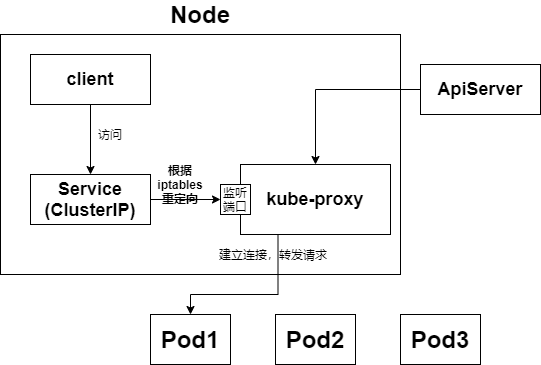

Pod IP不固定，是动态分配的，所以我们不推荐直接使用Pod IP来访问Pod，为了方便访问Pod，我们提供了Service

Service——对提供相同服务的Pod进行聚合，提供一个统一的访问入口，我们就可以通过Service提供的访问入口来访问Pod


## 1. kube-proxy

Service只是一个概念，真正起作用的是 **kube-proxy**

每个Node上都有一个 **kube-proxy**，当创建Service时，ApiServer会向etcd写入Service信息，每个Node上的kube-proxy基于监听机制发现Service的创建，然后 **将Service信息转换为对应的访问规则**


* kube-proxy支持三种工作模式

#### 1.1 userspace模式



1. kube-proxy会为每个Service都分配一个监听端口

2. Client访问Service的ClusterIP，该请求被iptables规则重定向到kube-proxy的监听端口上

3. kube-proxy收到请求，根据LoadBalance算法选择一个Pod并与其建立连接，将请求转发给Pod

kube-proxy充当一个四层负载均衡器的角色——稳定但是效率低


#### 1.2 iptables模式

1. kube-proxy为每个Pod建立iptables规则
2. Client访问Service的ClusterIP，该ClusterIP会重定向为一个PodIP

kube-proxy只负责创建iptables规则——效率高，但是无法提供灵活的LoadBalance策略

#### 1.3 ipvs模式

类似iptables模式，kube-proxy监控Pod的变化并创建相应的ipvs规则。ipvs相对iptables转发效率更高。除此以外，ipvs支持更多的LB算法。


## 2. Service使用

### 2.1 资源清单

```yaml
kind: Service  # 资源类型
apiVersion: v1  # 资源版本
metadata: # 元数据
  name: service # 资源名称
  namespace: dev # 命名空间
spec: # 描述
  selector: # 标签选择器，用于确定当前service代理哪些pod
    app: nginx
  type: # 指定service的访问方式
  clusterIP:  # Service在集群内部的虚拟IP
  sessionAffinity: # session亲和性，支持ClientIP、None两个选项
  ports: # 端口信息
    - protocol: TCP #协议
      port: 3017  # service暴露的端口
      targetPort: 5003 # pod端口
      nodePort: 31122 # service在每台node上对外暴露的端口
```

**spec.type**

- **ClusterIP**：默认值，它是Kubernetes系统自动分配的虚拟IP，只能在集群内部访问，会分配cluster_ip，集群内部的pod 解析serviceName获得的是service分配到的cluster_ip，而不是pod_ip
- **NodePort**：将Service通过指定的Node上的端口暴露给外部，通过此方法，就可以在集群外部访问服务
- **LoadBalancer**：使用外接负载均衡器完成到服务的负载分发，注意此模式需要外部云环境支持
- **ExternalName**： 把集群外部的服务引入集群内部，直接使用
- **Headless**：集群内部的Service，不会分配ip，集群内部的pod 可以解析**serviceName.namespace**获得pod_ip


### 2.2 Endpoint

我们创建一个Service后

```shell
[root@master b-k8s]# kubectl describe service nginx-service -n dev
Name:              nginx-service
Namespace:         dev
Labels:            <none>
Annotations:       <none>
Selector:          app=nginx
Type:              ClusterIP
IP:                10.96.184.123
Port:              <unset>  80/TCP
TargetPort:        80/TCP
Endpoints:         10.100.1.54:80,10.100.1.55:80,10.100.2.26:80
Session Affinity:  None
Events:            <none>
```

Endpoint是Kubernetes中的一种资源对象，存储在etcd中，用来记录一个Service对应的所有Pod的PodIP

Service和Pod之间的联系是通过Endpoint实现的


### 2.3 负载分发策略

Service有两种负载分发策略

- 如果不定义，默认使用kube-proxy的策略，比如随机、轮询

- 基于客户端地址的会话保持模式，即来自同一个客户端发起的所有请求都会转发到固定的一个Pod上

  此模式可以使在spec中添加`sessionAffinity:ClientIP`选项


### 2.4 HeadLiness Service

1. headless Service不会分配clusterIP
2. 集群内的任意一个pod，都可以通过 servicename.namespace 解析得到service后面的一个pod
3. 如果headless service后面是StatefulSet的Pod，那么还会为每个Pod分配一个域名 pod_name-0(1,2).servicename.namespace，可以通过pod的域名进行访问
4. 如果是headless service后面是Deploy的Pod，那么就不会分配域名

```yaml
apiVersion: v1
kind: Service
metadata:
  name: service-headliness
  namespace: dev
spec:
  selector:
    app: nginx-pod
  clusterIP: None # 将clusterIP设置为None，即可创建headliness Service
  type: ClusterIP
  ports:
  - port: 80    
    targetPort: 80
```


### 2.5 NodePort Service

将Service的一个端口映射到每个Node的某个端口上，供外界访问

```yaml
apiVersion: v1
kind: Service
metadata:
  name: service-nodeport
  namespace: dev
spec:
  selector:
    app: nginx-pod
  type: NodePort # service类型
  ports:
  - port: 80
    nodePort: 30002 # 指定绑定的node的端口(默认的取值范围是：30000-32767), 如果不指定，会默认分配
    targetPort: 80
```


### 2.6 LoadBalance Service

LoadBalancer和NodePort很相似，目的都是向外部暴露一个端口，区别在于LoadBalancer会在集群的外部再来做一个负载均衡设备，而这个设备需要外部环境支持的，外部服务发送到这个设备上的请求，会被设备负载之后转发到集群中。


###  2.7 ExternalName Service

ExternalName类型的Service用于引入集群外部的服务，它通过`externalName`属性指定外部一个服务的地址，然后在集群内部访问此service就可以访问到外部的服务了。


```yaml
apiVersion: v1
kind: Service
metadata:
  name: service-externalname
  namespace: dev
spec:
  type: ExternalName # service类型
  externalName: www.baidu.com  #改成ip地址也可以
```


## 3. Ingress

### 3.1 为什么需要Ingress

Service对集群之外暴露服务的主要方式有两种：NotePort和LoadBalancer，但是这两种方式，都有一定的缺点：

- NodePort方式的缺点是会占用**很多**集群机器的**端口**，那么当集群服务变多的时候，这个缺点就愈发明显
- LoadBalancer方式的缺点是每个service需要一个LoadBalancer，浪费、麻烦，并且需要kubernetes之外设备的支持

Kubernetes提供了 Ingress资源，只需要一个NodePort就可以满足多个Service的需要


### 3.2 Ingress如何工作

**两个重要概念**

* **Ingress**

  定义请求如何转发到service的规则

* **Ingress Controller**

  具体实现反向代理及负载均衡的程序，对Ingress定义的规则进行解析，根据配置的规则来实现请求转发**（有很多种，Nginx，Contour, Haproxy等等）**

> Ingress例子：以Nginx为例
>
> 1. 用户编写Ingress规则，说明域名与Service之间的对应关系
> 2. Ingress Controller动态感知Ingress规则的变化，根据Ingress规则生成对应的Nginx配置
> 3. Ingress Controller将生成的Nginx配置写入一个Nginx服务，并动态更新
> 4. Nginx服务监听80和443端口，集群外用户访问这两个端口即可访问到集群内的服务，不需要多余的NodePort


