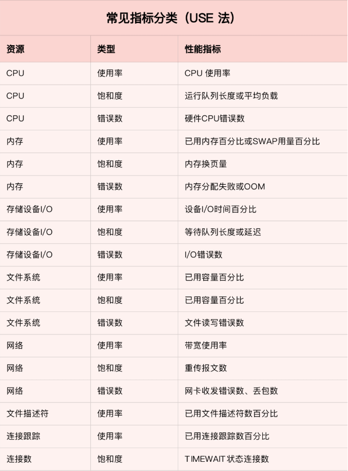

* 要做好监控，最核心的是全面的，可量化的指标，包括系统和应用两个方面
  * **系统监控**——监控系统要涵盖系统的整体资源使用情况，比如CPU，内存，磁盘，文件系统，网络等各种系统资源
  * **应用程序监控**——监控系统要涵盖应用程序内部的运行状态，包括进程的CPU，内存，磁盘IO等运行情况，更需要包括诸如接口调用耗时，执行过程中的错误，内部对象的内存使用情况等应用程序内部的运行状况

# 1. 系统监控

## 1.1 USE法

USE（Utilization Saturation and Errors）

* USE法将系统资源的性能指标简化为3个类别——使用率，饱和度，错误数
  * 使用率——表示资源用于服务的时间或容量百分比（100% 的使用率，表示容量已经用尽或者全部时间都用于服务）
  * 饱和度——表示资源的繁忙程度，通常与等待队列的长度相关（100% 的饱和度，表示资源无法接受更多的请求）
  * 错误数——发生错误的事件个数（错误数越多，系统的问题越严重）

## 1.2 性能指标（USE法）

# 2. 应用程序监控

## 2.1 应用监控指标

* 应用监控的核心指标
  * 请求数，错误率和响应时间
  * 应用进程的资源使用情况（进程占用的CPU，内存，磁盘IO，网络）
  * 应用程序之间的调用情况（调用频率，错误数，延时）
  * 应用程序内部核心逻辑的运行情况（关键环节的耗时，执行过程中的错误）——应用程序在设计和开发时，应该把这些指标提供出来，以便监控系统了解其内部运行状态

## 2.2 全链路监控

## 2.3 日志监控

