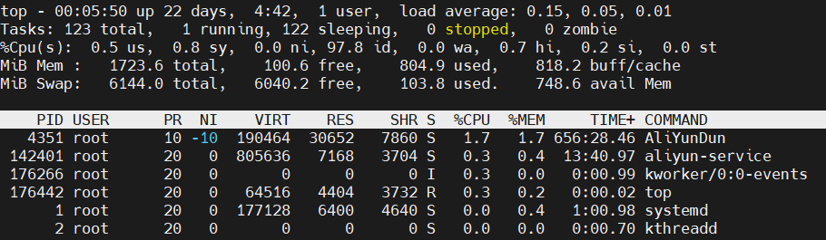

## top命令使用

```shell
top [-] [d] [p] [q] [c] [S] [s] [n]
-d：后跟秒数，指定两次屏幕信息刷新之间的时间间隔
-p进程ID：查看进程ID的进程信息
-q：让top没有任何延迟的进行刷新
-S:指定累计模式
-s:让top在安全模式下运行
-i:让top不显示任何闲置进程or僵尸进程
-c:显示整个命令行而不只显示命令名
```

## top命令信息



### 统计信息区

#### 第一行


> 00:05:50——当前时间
> 
> up 22 days——系统运行时间
> 
> 1 user——当前登录用户数
> 
> load average: 0.15,0.05,0.01——系统负载（任务队列的平均长度），分别是1分钟，5分钟，15分钟统计的平均值

#### 第二行


* **进程情况**

> 123 total——进程总数
> 
> 1 running——正在运行的进程数目
> 
> 122 sleeping——睡眠的进程数目
> 
> 0 stopped——停止的进程数目
> 
> 0 zombie——僵尸进程数目

#### 第三行


* **CPU使用情况**

> 0.5 us——用户空间占用CPU百分比
> 
> 0.8 sy——内核空间占用CPU百分比
> 
> 0.0 ni——用户进程空间内改变过优先级的进程占用CPU百分比
> 
> 97.8 id——空闲CPU百分比
> 
> 0.0 wa——等待输入输出的CPU时间百分比
> 
> 0.7 hi——硬中断占用CPU的百分比
> 
> 0.2 si——软中断占用CPU的百分比
> 
> 0.0 st——是当 hypervisor 服务另一个虚拟处理器的时候，虚拟 CPU 等待实际 CPU 的时间的百分比

#### 第四行


* **内存使用情况**

> total——物理内存总量
> 
> free——空闲内存总量
> 
> used——使用的物理内存总量
> 
> buff/cache——用作内存缓存的内存量

#### 第五行


* **Swap使用情况**

> total——交换区总量
> 
> free——空闲的交换区总量
> 
> used——正在使用的交换区总量
> 
> avail Mem——缓冲的交换区总量

### 进程信息区


> PID：进程ID
> 
> PPID：父进程ID
> 
> USER：进程所有者用户名
> 
> UID：进程所有者的用户ID
> 
> PR：优先级
> 
> NI：nice值
> 
> VIRT：进程使用的虚拟内存总量（单位kb，VIRT=SWAP+RES）
> 
> RES：进程使用的，未被换出的物理内存的大小（单位kb，RES=CODE+DATA）
> 
> SWAP：进程使用的虚拟内存中，被换出的大小（单位kb）
> 
> CODE：可执行代码占用的物理内存大小（单位KB）
> 
> DATA：进程可执行代码以外的部分（数据段+栈）占用的物理内存大小（单位kb）
> 
> SHR：共享内存大小（单位kb）
> 
> S：进程状态（D：不可中断的睡眠状态，R：Running，S：Sleep，T：停止，Z：僵尸进程）
> 
> %CPU：上次更新到现在的CPU使用时间占用百分比
> 
> %MEM：进程使用的物理内存百分比
> 
> TIME：进程使用的CPU时间总计，单位s
> 
> TIME+：进程使用的CPU时间总计，单位0.01s
