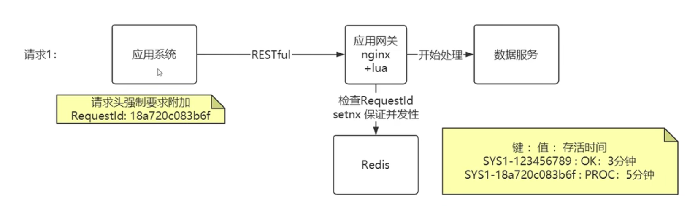
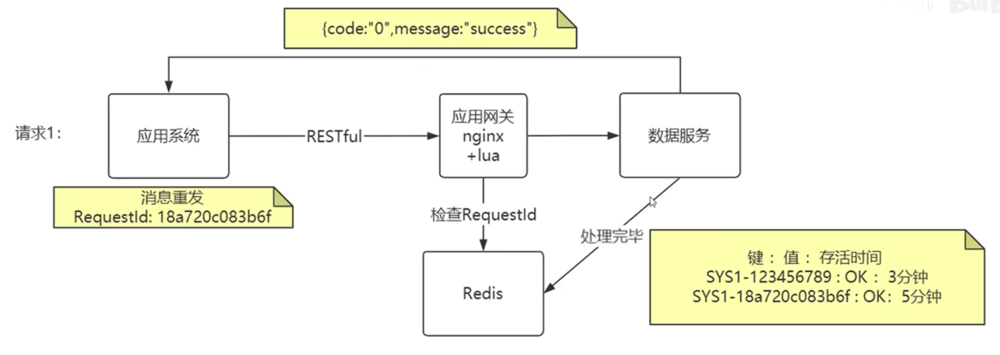
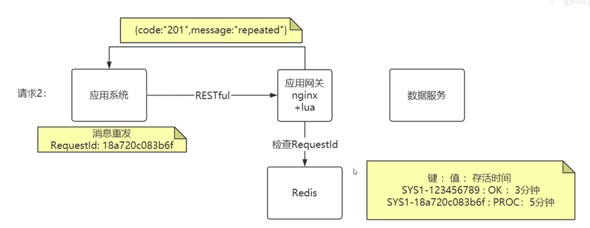
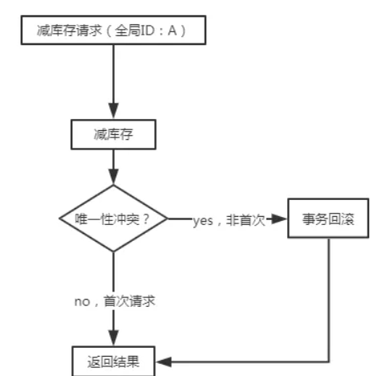

**幂等性**——接口调用1次和连续调用多次的结果是相同的

### 1. HTTP的幂等性

|  方法   | 幂等 |       描述       |
| :-----: | :--: | :--------------: |
|   GET   |  √   |     天然幂等     |
|  HEAD   |  √   |     天然幂等     |
| OPTIONS |  √   |     天然幂等     |
| DELETE  |  √   |     天然幂等     |
|   PUT   |  √   |     天然幂等     |
|  POST   |  ×   | 需要我们支持幂等 |

### 2. 幂等表

需要一种无侵入的幂等解决方案——构建**幂等表**

* **首次请求**

  

* **成功处理**

  

* **多次发送**

  

通过幂等表，在请求到达数据服务前进行幂等处理，数据服务无需考虑接口幂等问题

**一般可以通过AOP After通知，在接口调用后更新Redis状态**

* **优点**

  * 对于后台服务是无代码侵入，无需修改业务逻辑

* **缺点**

  * 架构复杂度增加，需要额外部署Nginx，Redis

  

### 3. 全局ID

为每个接口添加一个参数——全局ID

