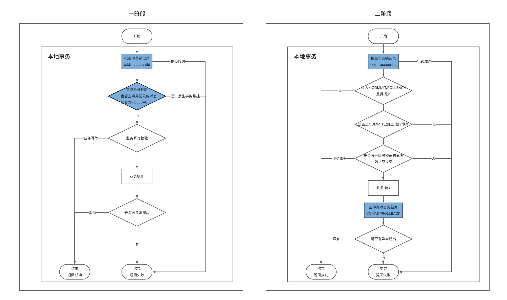
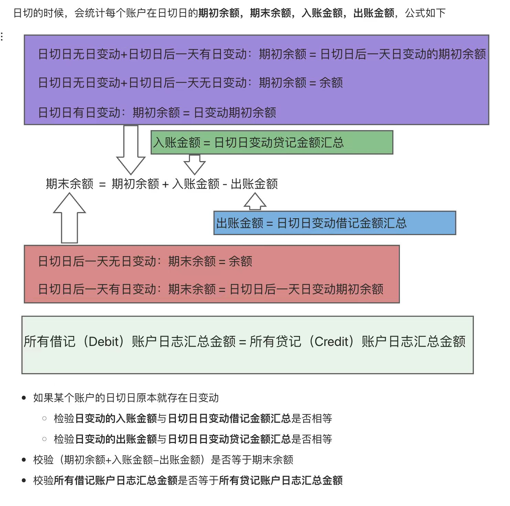
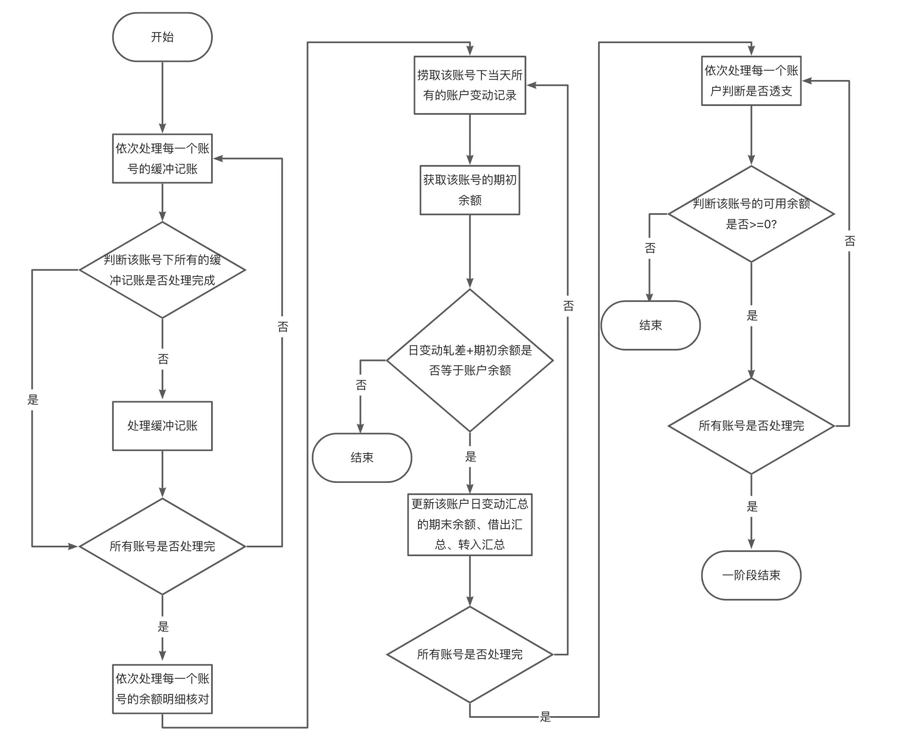
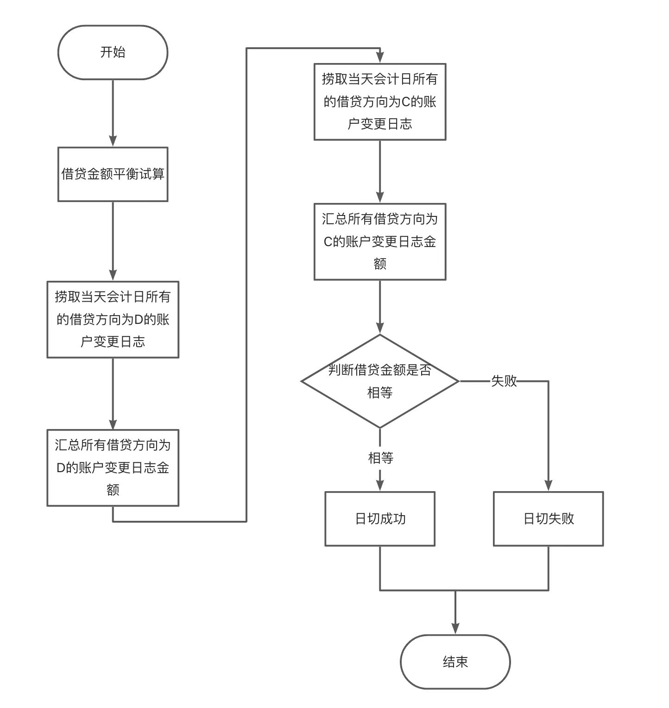

### 1. 项目背景
蚂蚁培训项目，实现一个简易的支付宝，拆分为业务中心，用户中心、账务中心。我负责的账务中心主要功能
* 开户
* 转账
* 余额查询
* 日切：核对交易流水平衡与账户流水平衡
* 缓冲记账
* 账户明细查询
* 账户日变动查询

压测，转账单机单用户TPS20,开启缓冲记账后单机单用户TPS85(平均100ms左右，超时时间3000ms，)
### 2. 设计
* 账户
  * 账户id 
  * 账户类型
  * 余额模型
  * status
* 账户操作日志(账户明细)
  * 操作类型(借记or贷记)
  * 记账类型(标准记账or缓冲记账)
  * status(INIT/SUCCESS)
* 账户日变动(汇总账户每天的发生额变动)
  * 入账金额
  * 出账金额
  * 期初余额
  * 期末余额
* 账户期末余额(记录账户日切点的期末额，台账)
* 主事务
  * txId
  * accountId
  * status(PREPARE/COMMIT/ROLLBACK)

#### 2.0 账户id
* 所有的库的分库分表位都使用账户ID的后8位
* 账户ID的后8位来自用户id

这样使得一个用户的所有账户数据都在一个库上

#### 2.1 转账
* 转账分为两阶段
  * 一阶段进行余额检查和资金预留
  * 二阶段真正地对账户余额进行更新
* 防悬挂——通过主事务记录来实现防悬挂,主事务记录状态有PREPARE,COMMIT,ROLLBACK,一二阶段共用一条主事务记录，并且都会对主事务记录上锁（保证一二阶段互斥），通过主事务记录的状态来判断防悬挂、幂等
  * 一阶段——主事务记录上锁（如果不存在则插入PREPARE后上锁），校验状态不为ROLLBACK。
  * 二阶段——主事务记录上锁（如果不存在则插入PREPARE后上锁），状态校验（允许重复提交，重复回滚，不允许提交已经回滚的事务，允许空回滚，不允许空提交），执行完业务操作后主事务记录状态更新为COMMIT/ROLLBACK
    
* 幂等
  * 一阶段幂等：check一阶段预留资源（操作日志/流水记录）  
  * 二阶段幂等：主事务记录状态判断+check是否有一阶段预留资源（操作日志/流水记录）

##### 2.1.1 一阶段流程
（一阶段核心操作——落操作日志，修改余额模型为二阶段预留金钱）  
1. 防悬挂判定
2. 账户上锁
3. 业务幂等判定——是否存在操作日志/流水记录
4. 区分操作类型
   * 贷记(in)——do noting
   * 借记(out)——更新账户的余额模型，余额校验
5. 保存操作日志/流水记录
6. 保存账户数据
##### 2.1.2 二阶段流程
（二阶段核心操作——消费一阶段落的操作日志，更新余额模型，落账户日变动）
1. 通过主事务记录的状态进行判定（允许重复提交，允许重复回滚，不允许提交已经回滚的事务）
2. 账户上锁
3. 捞取一阶段持久化的操作日志/流水记录进行处理(如果不存在操作日志，则是空回滚or空提交，允许空回滚，不允许空提交)
   * commit——修改操作日志状态为SUCCESS，落账户日变动
   * rollback——删除操作日志
4. 更新账户的余额模型
5. 更新账户数据
6. 更新主事务记录状态(COMMIT/ROLLBACK)

#### 2.2 余额模型(标准模型)
* balance:余额(账户里总共有多少钱,事务外可见)
* frozenAmount:冻结金额(账户里的钱有多少冻结了无法使用,事务外可见)
* systemAmount:系统金额(转账一阶段transferOut预留的金额,事务外可见)
* 事务未达金额(转账一阶段transferIn预留的金额，同一事务可见，其他事务不可见)   

事务中可用余额 = balance - frozenAmount - systemAmount + 本事务中的事务未达金额  
事务外可用余额 = balance - frozenAmount - systemAmount  
(同一个事务中，优先使用未达金额，未达金额不足时，再使用系统金额)

#### 2.3 缓冲记账
默认走标准记账流程，一旦出现记账超时报错，通过监控告警可以发现，第一时间将该账户配置到缓冲记账白名单中(分为借记白名单、贷记白名单），后续该用户走缓冲记账流程。  
* 阶段一
  * 防悬挂判定
  * 业务幂等判定——是否存在操作日志/流水记录
  * 保存操作日志/流水记录
* 阶段二
  * 通过主事务记录的状态进行判定（允许重复提交，允许重复回滚，不允许提交已经回滚的事务）
  * 更新主事务记录状态
* 异步处理(1分钟1次)
  * 捞取账户的操作日志，批量处理，落账户日变动，更新账户的余额
#### 2.4 日切
日切用于检查账务中心记账是否正确,同时也防篡改

#### 2.5 核对
核对可以检验上下游数据是否一致，同时也可以防篡改  
核对——证证核对，证账核对，账账核对，账实核对  
我做了证账核对  
* 业务中心的订单明细与账务中心的交易明细进行核对（T+1）
* 业务中心的订单总额与账务中心的交易明细总额进行核对（T+1）