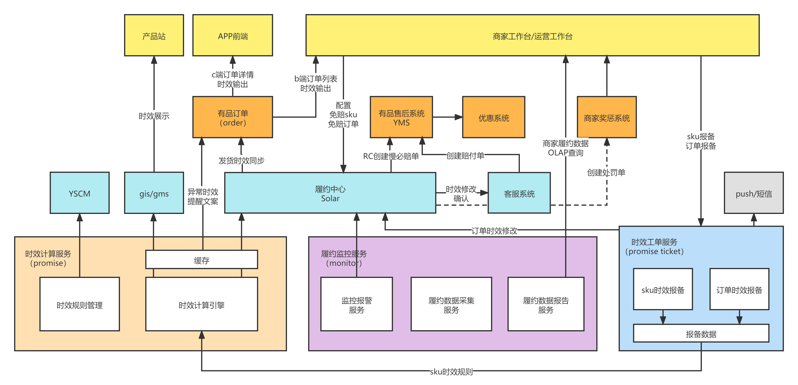

# 1. 项目介绍

## 1.1 概念(*)

* Promise：实效计算服务
* 履约时效：向用户承诺的发货时间（由promise计算）
* 慢必赔：如果商家的真实发货时间超过了履约时效，履约中心会创建慢必赔付单，对商家做出惩罚的同时，赔付消费者一定面额的红包
* sku时效黑名单：一个商品对应一个skuId，将skuId加入黑名单后，该商品的真实发货时间超过了履约时效，就不会触发慢必赔
* 订单时效黑名单：一个订单有一个唯一的orderId，将order加入黑名单后，该订单中商品的真实发货时间超过了履约时效，就不会触发慢必赔


## 1.2 架构(*)



### 1.2.1 promise(*)

时效计算服务——根据配置的时效规则来计算 **履约时效**，同时管理sku时效黑名单和订单时效黑名单

* 时效规则来自promise ticket(时效工单服务)
* **履约时效** 计算完成后，会发送给 order(订单服务) 和 solar(履约中心)


### 1.2.2 solar(*)

履约中心

1. 存储履约时效  

2. 收到monitor监控，接受到monitor发送来的失约信息后，触发慢必配流程

* solar让客户系统对商品的履约时效进行修改(延期)，并对通过商家系统对商家进行惩罚
* solar让售后系统创建慢必赔偿单，售后系统让优惠系统向用户发放优惠卷


### 1.2.3 monitor(*)

履约监控服务——监控solar，如果商品的真实发货时间超过了履约时效，将失约信息发送给Solar


### 1.2.4 promise ticket(*)

时效工单服务

* 商家/运营 上传 sku时效规则，订单时效规则给promise ticket，这些时效规则由promise ticket统一管理
* 将时效规则 报备给 promise，promise根据时效规则计算 **履约时效**


# 2. 需求

## 2.1 promise总需求


## 2.2 sku时效黑名单与RocketMQ与定时任务调度(精华)

sku时效黑名单有2种状态——启用和停用

sku时效黑名单还有一个属性——生效时间

如果是启用状态，那么sku时效黑名单的生效指的是——在生效时间到达时发送**sku时效黑名单生效消息**给gis（gis需要这个消息来更新sku所关联的pid的缓存，影响慢必赔标签展示）


我们的业务特性，sku时效黑名单的生效时间一般都是在大促(双十一，双十二)，这也就意味着平时生效的sku时效黑名单的数量不多，但是一旦到了大促的时候，生效的sku时效黑名单就非常多了，也就意味着会给gis发送非常多的消息，这就产生了第一个问题

### 2.2.1 第一个问题

**gis提供的RPC接口无法承受如此庞大的瞬时流量，如果让gis安全稳定地接受这大量的消息呢？**

我引入了RocketMQ来解决这一问题，promise将消息发送给RocketMQ，然后由RocketMQ发送给gis，通过RocketMQ达到 **流量削峰**的作用


### 2.2.2 第二个问题

**promise创建好sku时效黑名单后，是直接将sku时效黑名单信息发送给RocketMQ，然后由RocketMQ在指定的时间发送给gis呢？**

**还是promise在达到生效时间时把信息发送给RocketMQ，然后由RocketMQ发送给gis？**

首先我们看后一个方案，这个方案需要一个线程不断的全表扫描，寻找到达生效时间的sku时效黑名单，将其发送给Rocket

这个方案有2个缺点

1. 效率低下，同时增加的数据库的压力
2. promise不是单机，而是有多个实例，这可能会导致消息重发（多个promise实例同时在数据库中找到一个到达生效时间的sku时效黑名单，然后同时向RocketMQ发送该sku时效黑名单的消息）

所以我们采用前一个方案，但这带来了第三个问题

### 2.2.3 第三个问题

**如何让RocketMQ在指定的任意时间发送消息？**（以下是我的技术选型过程）

1. 开源版本的RocketMQ只提供延时消息，就是延迟1s，1min，1h来发送消息，不满足需求

2. RocketMQ任意延时消息（公司RocketMQ团队提供技术支持）：可以指定RocketMQ在 某年某月某日某分某秒 发送消息给消费者，但是只支持3天内，不满足需求

3. RocketMQ任意延时+Redis：将未生效的sku时效黑名单的数据存储在Redis中，开启一个定时任务每天访问一次Redis，找出距离生效时间<3天的sku时效黑名单，使用RocketMQ的任意延时消息发送

   * 不使用的原因
     * sku实效黑名单是可以被停用的，如果sku实效黑名单生效前被停用了，我们就需要让RocketMQ不要发送对应的消息，也就是需要从RocketMQ中删除掉消息，这个技术方案无法做到

4. 定时调度系统+RocketMQ

   * 引入公司的定时调度系统，用户创建一个sku实效黑名单时候，会使用黑名单的生效时间向定时调度系统创建一个定时任务（创建定时任务时会指定定时任务触发时回调哪一个服务的哪一个方法，回调时传递的参数）

   * 当到达生效时间时，定时调度系统会回调指定的方法，将sku时效黑名单的消息发送给RocketMQ
   * 定时调度系统提供任务取消功能，在到达任务的生效时间之前，可以将任务取消掉


### 2.2.4 sku时效黑名单的四个动作

1. **sku时效黑名单创建**
   * 改DB
   * 向定时调度系统创建定时任务，并获得定时任务的taskId
   * 将taskId存入DB
2. **sku时效黑名单由启用—>停用**
   * sku时效黑名单还未生效
     * 改DB
     * 让定时调度系统取消定时任务
   * sku实效黑名单已生效
     * 改DB
     * 立刻向RocketMQ发送一条失效消息（skuId，taskId，isValid=0）
3. **sku时效黑名单由停用—>启用**
   * 改DB
   * 向定时调度系统创建定时任务，并获得定时任务的taskId
   * 将taskId存入DB
4. **sku时效黑名单生效时间更新**
   * sku时效黑名单还未生效
     * 改DB
     * 让定时调度系统取消定时任务
     * 使用新的生效时间来向定时调度系统创建新的定时任务，并获得新的taskId
     * 将taskId存入DB
   * sku时效黑名单已生效
     * 立刻向RocketMQ发送一条失效消息（skuId，taskId，isValid=0）
     * 改DB
     * 使用新的生效时间来向定时调度系统创建新的定时任务，并获得新的taskId
     * 将taskId存入DB


## 2.3 我负责的需求

我负责promise的sku时效黑名单和订单时效黑名单模块


### 2.3.1 sku时效黑名单

#### 2.3.1.1 批量导入sku时效黑名单(*)

需要进行以下校验

1. 一次性导入的量<=200
2. skuId存在性校验——不存在，返回错误信息"SKU ID不存在"
3. 生效时间校验——生效时间必须晚于当前时间

如果sku已经存在于sku黑名单中，进行覆写，否则创建

* 创建(同**sku时效黑名单创建**)
  * 改DB
  * 向定时调度系统创建定时任务，并获得定时任务的taskId
  * 将taskId存入DB
* 覆写
  * sku黑名单原本为停用状态(同**sku时效黑名单由停用—>启用**)
    * 改DB
    * 向定时调度系统创建定时任务，并获得定时任务的taskId
    * 将taskId存入DB
  * sku黑名单原本为启用状态——**更新生效时间**
    * 未生效(同**sku时效黑名单生效时间更新——sku时效黑名单还未生效**)
      * 改DB
      * 让定时调度系统取消定时任务
      * 使用新的生效时间来向定时调度系统创建新的定时任务，并获得新的taskId
      * 将taskId存入DB
    * 已生效(同**sku时效黑名单生效时间更新——sku时效黑名单已生效**)
      * 立刻向RocketMQ发送一条失效消息（skuId，taskId，isValid=0）
      * 改DB
      * 使用新的生效时间来向定时调度系统创建新的定时任务，并获得新的taskId
      * 将taskId存入DB

#### 2.3.1.2 对于一个存在的sku时效黑名单可以进行启用和停用(*)

* **sku时效黑名单由启用—>停用**
  * sku时效黑名单还未生效
    * 改DB
    * 让定时调度系统取消定时任务
  
  * sku实效黑名单已生效
    * 改DB
      * 立刻向RocketMQ发送一条失效消息（skuId，taskId，isValid=0）
  
* **sku时效黑名单由停用—>启用**

  * 改DB

  * 向定时调度系统创建定时任务，并获得定时任务的taskId

  * 将taskId存入DB


#### 2.3.1.3 sku时效黑名单查询

* 可以根据skuId精确查询

* 可以根据status进行查询（查询启用的sku时效黑名单/查询停用的sku时效黑名单）
* 全量查询

#### 2.3.1.4 gis查询已经生效的sku时效黑名单

* 全量查询已经生效的sku时效黑名单（valid_time<now() and 状态为启用）

### 2.3.2 订单时效黑名单

#### 2.3.2.1 批量导入订单时效黑名单(*)

需要做以下校验

1. 一次性导入的量<=200
2. 订单存在性校验——不存在，返回错误信息"订单不存在"
3. 订单赔付性校验——如果订单赔付过了，返回错误信息"订单已赔付"
4. 同一批次导入中有多个相同的订单号——返回错误信息

#### 2.3.2.2 订单时效黑名单查询

* 可以根据orderId精确查询
* 全量查询


# 3. 数据

## 3.1 表结构

```sql
CREATE TABLE erp_merchant_promise_sku_blacklist (
  id int(11) NOT NULL AUTO_INCREMENT COMMENT '文案模板id',
  sku_id varchar(50) NOT NULL COMMENT 'skuId',
  reason varchar(50) NOT NULL COMMENT '原因',
  remark varchar(100) DEFAULT NULL COMMENT '备注',
  task_id int(11) DEFAULT NULL COMMENT '定时任务id',
  valid_time datetime NOT NULL COMMENT '生效日期',
  status tinyint(1) NOT NULL COMMENT '黑名单状态1有效0无效',
  operator varchar(50) NOT NULL COMMENT '更新人',
  create_time datetime DEFAULT CURRENT_TIMESTAMP COMMENT '增加时间',
  update_time datetime DEFAULT CURRENT_TIMESTAMP ON UPDATE CURRENT_TIMESTAMP COMMENT '更新时间',
  PRIMARY KEY (id),
  UNIQUE key(sku_id),
  UNIQUE key(task_id),
  key(valid_time,status)
) ENGINE=InnoDB DEFAULT CHARSET=utf8 COMMENT='sku慢必赔黑名单表';
```


```sql
CREATE TABLE erp_merchant_promise_order_blacklist (
  id int(11) NOT NULL AUTO_INCREMENT COMMENT '文案模板id',
  order_id bigint NOT NULL COMMENT 'orderId',
  reason varchar(50) NOT NULL COMMENT '原因',
  remark varchar(100) DEFAULT NULL COMMENT '备注',
  status tinyint(1) NOT NULL COMMENT '黑名单状态1有效0无效',
  operator varchar(50) NOT NULL COMMENT '更新人',
  create_time datetime DEFAULT CURRENT_TIMESTAMP COMMENT '增加时间',
  update_time datetime DEFAULT CURRENT_TIMESTAMP ON UPDATE CURRENT_TIMESTAMP COMMENT '更新时间',
  PRIMARY KEY (id),
  UNIQUE key(order_id)
) ENGINE=InnoDB DEFAULT CHARSET=utf8 COMMENT='订单慢必赔黑名单表';
```


## 3.2 RocketMQ消息

发送给MQ的信息如下

| topic  | promise_sku_blacklist_topic | 备注                                         |
| ------ | --------------------------- | -------------------------------------------- |
| 生产者 | promise时效服务             | mos更新sku黑名单后发消息                     |
| 消费者 | gis                         | 更新sku所关联的pid的缓存，影响慢必赔标签展示 |
|        |                             |                                              |

```json
{
      "taskId": "xxxx",
      "skuId": "3000001",
      "isVaild": 1(0)
}
```


# 4. 功能实现

## 4.1 通过Redis实现请求去重

1. 通过MD5算法为请求参数生成一个唯一的UniqueKey（请求参数的类名+请求参数的json串）
2. 对UniqueKey在Redis进行自增操作，获得自增后的值exact，并设置过期时间5s（原子操作）
3. 如果exact为1，那么是首次请求，可以访问接口，否则不能访问接口
