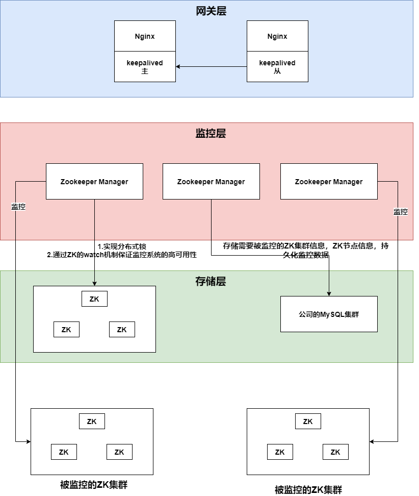
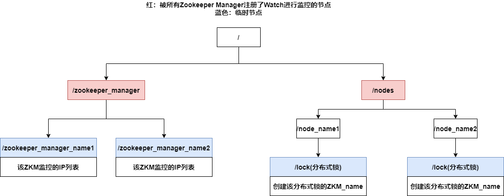

# 1. 架构

## 1.1 整体架构

## 1.2 自用Zookeeper数据模型

# 2. Zookeeper Manager运行介绍

## 2.1 Zookeeper Manager启动

1. Zookeeper Manager启动的时候，会确保/zookeeper_manager，/nodes这两个节点是一定存在的，并在这两个节点上添加listener进行监听
   
   监听/zookeeper_manager和/nodes下子节点的创建，删除，数据更新

2. Zookeeper Manager会在/zookeeper_manager下创建 以zookeeper_manager_name为路径的临时节点，该节点存储了zookeeper_manager监控哪些node
   
   Zookeeper Manager启动后，会与自用ZK通过心跳机制保持连接，一旦Zookeeper Manager死亡，那么其在自用ZK上创建的所有临时节点都会消失

## 2.2 Zookeeper Manager如何运行，如何保证高可用性

1. 对于集群中的每一个节点，一定有一个/nodes/node_name节点

2. 前面我们说过每台Zookeeper manager都会监控/zookeeper_manager，/nodes节点，监听/zookeeper_manager和/nodes下子节点的创建，删除，数据更新
   
   一旦/nodes下创建了/nodes/node_name节点，所有的zookeeper manager都会收到通知，来视图获得该节点的监控权
   
   **我通过Zookeeper分布式锁，来分配node的监控权——只有分布式锁的拥有者，才可以进行监控**
   
   每台Zookeeper Manager收到/nodes/node_name创建的通知后，都会尝试创建/nodes/node_name/lock临时节点，并将自己的唯一标识写入该lock节点
   
   如果创建成功，就代表成功获得了该node对应的分布式锁，该node的**监控权**归创建成功的Zookeeper Manager所有（Zookeeper会保证只有一个Zookeeper Manager可以创建成功）

3. **Zookeeper 事件通知机制发送死亡通知保证监控系统的高可用性**——如果一个Zookeeper Manager宕机，那么其/zookeeper_manager/zkm_name节点和它创建的所有/nodes/node_name/lock节点都会消失，其余存活的Zookeeper Manager都会收到Zookeeper的watch通知，从通知中可以知道死亡的Zookeeper Manager原本监控的ZK列表，然后去遍历ZK列表中每个ZK对应的/nodes/node_name节点，尝试在其下创建/lock临时节点获得分布式锁，获得监控权

4. **假死/通知丢失——通过定时任务进行补偿**
   
   * **假死**——如果一台ZKM运行正常，但是由于网络问题与自用ZK断开连接，那么自用ZK认为该ZKM死亡，会删除掉该ZKM的/zookeeper_manager/zkm_name节点和其创建的所有/lock节点，并将死亡通知发送给存活的ZKM，但是这台ZKM并没有死亡，被误报死亡的ZKM监控的ZK被2台ZKM监控
   * **通知丢失**——如果一台ZKM死亡后，ZK发出的死亡通知因为网络问题无法发送给其余的ZKM，那么会导致死亡的ZKM原先监控的ZK无人监控
   
   ZKM中设置了2个定时任务
   
   1. 定时任务会获取/nodes下的所有子节点，对于每个子节点/nodes/node_name，检查其是否有子节点/lock，如果没有的话，就会尝试创建，创建成功就取得分布式锁，对node进行监控（对通知丢失进行补偿）
   
   2. 定时任务定期判断自己与自用ZK的网络连接是否良好（对假死进行补偿）
      
      * 如果不良好，放弃掉所有正在执行的监控任务
      * 如果良好，会去自用ZK中检查，自己正在监控的ZK的分布式锁的创建者是否为自己
        * 如果是，继续监控
        * 如果不是，放弃监控

## 2.3 ZK监控方案

对ZK的监控包括了三个方面

* **ZK节点可用性的监控**
  
  每个ZK节点上，对指定路径/zookeeper_manager/check进行三次如下操作，如果三次流程均成功且每次耗时在指定的时间范围内，认为该节点处于正常状态
  
  * 更新节点数据
  * 接受数据更新通知
  * 从通知中获取数据，进行比对

* **集群读写TPS的监控**

* **集群ZK运行状态数据统计**
  
  通过ZK提供的四字命令，做了整合，并持久化到数据库中——可以可视化地看到ZK的运行时数据，并且有的数据可以看到数据的变化趋势
  
  * ZK的角色
  * 集群节点数目
  * 内存数据大小
  * ZK提交的最后一个事务的ZXID
  * leader的Follower数目，Observer数目
  * 选举相关信息（选举耗时之类）
  * 未处理的请求数
  * 未同步的数据量
  * ZK集群中的znode数量，临时节点数目
  * ZK集群中的watch数量，Watch的详细信息
  * ZK收到的请求数
  * ZK返回的响应数
  * ZK的客户端连接数，客户端IP
  * ZK的延时时间（平均，最大，最小）
  * ZK所在服务器运行时的环境信息（os.version，java.version，user.home等）

# 3. 难点

## 3.1 如果保证一个node只会被一个zookeeper manager监控

* **这个问题是通过分布式锁来解决**，每一个node，在自用Zookeeper中都对应着一个/nodes/node_name节点，如果Zookeeper Manager想获得该node的监控权，就必须在/nodes/node_name下创建/nodes/node_name/lock临时节点，创建成功就代表成功获得了该node的分布式锁，可以对该node进行监控

* 同时为了防止死亡通知无法导致的问题（一个ZK被2个ZKM监控），每个ZKM都有一个定时任务去检查判断自己与自用ZK的网络连接是否良好（对死亡通知误发进行补偿）
  
  * 如果不良好，放弃掉所有正在执行的监控任务
  
  * 如果良好，会去自用ZK中检查，自己正在监控的ZK的分布式锁的创建者是否为自己
    
    * 如果是，继续监控
      * 如果不是，放弃监控

## 3.2 在某台zookeeper manager宕机的情况下，如何保证其监控的node不会没人监控

我从2个方面来解决这个问题

1. **通过Zookeeper的事件通知机制**
   
   Zookeeper提供异步通知机制——客户端可以通过为Zookeeper某个节点添加listener来对该节点进行监听，如果该节点及其子节点发生增删改，那么Zookeeper会发送通知给客户端
   
   正是利用这个机制，每个Zookeeper Manager会监听/zookeeper_manager,/nodes这两个节点，并且会在/zookeeper_manager下创建代表自己的/zookeeper_manager/zkm_name临时节点，该节点中存储了zookeeper manager监控的ZK列表
   
   当某台Zookeeper Manager宕机时，其对应的/zookeeper_manager/zkm_name节点会消失，其余存活的zookeeper manager会收到通知，然后获取死亡zookeeper manager监控的ZK列表，代替死亡zookeeper manager监控这些node

2. **定时任务——对通知丢失进行补偿**
   
   每个node对应一个/nodes/node_name节点，如果该node正在被监控，那么就存在/nodes/node_name/lock节点，反之，则没有被监控
   
   如果死亡通知由于网络问题丢失了，那么会出现ZK无人监控的情况——我设计了定时任务进行补偿
   
   所以每个Zookeeper Manager会执行定时任务，定时任务会获取/nodes下的所有子节点，对于每个子节点/nodes/node_name，检查其是否有子节点/lock，如果没有的话，就会尝试创建，创建成功就取得分布式锁，对node进行监控

# 4. 优化亮点

## 4.1 Zookeeper Controller——对zookeeper进行内嵌

Zookeeper Controller——对Zookeeper进行包装，外界只能访问Zookeeper Controller暴露出来的接口，不能直接访问Zookeeper

有以下好处

1. 提高了Zookeeper数据的安全性
2. 提高网络传输效率
   * Zookeeper提供四字命令(IP:port/commands/four-word-command)来获取监控数据，这其中有许多我们不需要的数据，Zookeeper Controller对原始监控数据进行筛选，过滤掉不需要的数据，减少网络传输的数据量
   * Zookeeper的四字命令使用的是HTTP协议，Zookeeper Controller使用Dubbo协议对外暴露接口，效率比HTTP协议高
3. 减少了运维人员的工作量，Zookeeper采用的策略是快速失败，一般情况下，Zookeeper宕机后需要运维人员手动重启，Zookeeper Controller提供了启动接口，重启接口，关闭接口，运维人员无需登录服务器对zookeeper手动操作，在页面上进行操作即可

## 4.2 实现ZK的动态配置

原本ZK集群如果想要进行水平扩容or缩容，必须重启集群中的所有服务器（可以整体重启，也可以逐台重启）

实现了动态配置后，无需重启ZK，即可进行水平扩容or缩容

* ZK提供的支持
  
  Zookeeper3.5.0后，ZK支持了动态配置参数（可以在运行时修改的参数），这些参数存储在/zookeeper/config节点中

* 将配置文件拆分为静态配置文件和动态配置文件，在静态配置文件中通过dynamicConfigFile字段来导入动态配置文件（动态配置文件中存放集群成员信息）
  
  * 动态配置文件中的数据会加载到/zookeeper/config节点中
  * 我们如果在ZK集群运行时修改了/zookeeper/config节点中的数据，这些动态配置参数会生成新的动态配置文件，覆盖原来的动态配置文件

* 假设现在要扩容一台ZK，我只需要讲集群的配置文件copy给该ZK，并且在动态配置文件中的集群成员信息中添加该ZK的信息，然后启动该ZK
  
  该ZK根据动态配置文件的信息，会尝试去加入集群，但是会被集群拒绝，该ZK成为no_voting_follower，但是会同步leader的数据
  
  然后对集群中所有的ZK执行reconfig -add命令，添加新的ZK信息，集群中的每台ZK都会生成一份新的动态配置文件，新的动态配置文件中的集群成员信息中添加了新加入的ZK的信息
  
  标志该ZK成功加入集群
